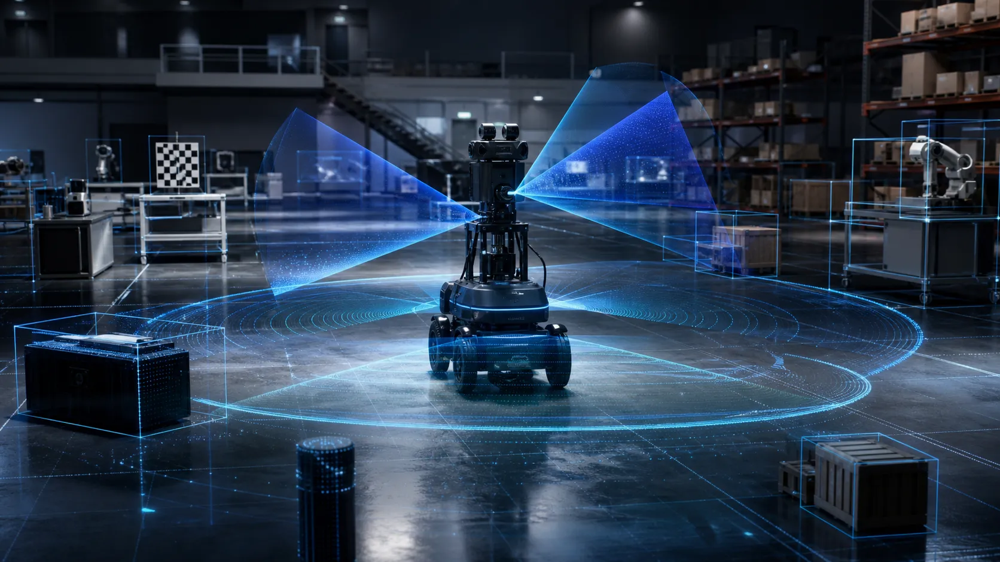

## Isaac Sim이 요구하는 이유

Isaac Sim은 일반적인 로봇 시뮬레이터와는 근본적으로 다른 하드웨어를 요구합니다. 그 이유는 세 가지 고성능 연산이 동시에 돌아가기 때문입니다.

**물리 시뮬레이션(PhysX)**: GPU 가속 PhysX 엔진이 강체·관절·연성체의 물리를 처리합니다. 병렬 훈련 시 수천 개의 환경을 동시에 시뮬레이션할 때 특히 GPU 메모리와 컴퓨팅 파워가 필요합니다.

**RTX 렌더링**: 레이트레이싱(ray tracing) 기반 렌더링은 전용 RT 코어가 있는 NVIDIA RTX 급 GPU가 필요합니다. 합성 데이터 생성 시 경로 추적 모드를 사용하면 VRAM 요구량이 크게 증가합니다.

**센서 시뮬레이션**: 라이다(LiDAR)·깊이 카메라 같은 센서를 물리적으로 시뮬레이션하는 것도 GPU 연산을 필요로 합니다.

이 세 가지가 결합된 결과, Isaac Sim의 하드웨어 요구사항은 일반 소프트웨어보다 상당히 높습니다.

## 하드웨어 요구사항

> **중요**: 정확한 최소/권장 사양은 Isaac Sim 버전에 따라 변경됩니다. 아래는 일반적인 가이드라인이며, 실제 설치 전 반드시 공식 문서(docs.isaacsim.omniverse.nvidia.com)에서 사용하려는 버전의 최신 사양을 확인하세요.

### GPU 요구사항

Isaac Sim은 **NVIDIA RTX 급 GPU**를 필요로 합니다. RTX라는 명칭은 레이트레이싱 전용 RT 코어를 탑재한 GPU 세대를 의미합니다.

```text
GPU 지원 등급 가이드라인 (버전에 따라 상이 — 공식 문서 기준 확인)

권장 (고성능 작업 기준)
┌────────────────────────────────────────────────────┐
│  RTX 3080 이상 / RTX 4080 이상 (워크스테이션)     │
│  A6000 / A100 / H100 (데이터센터 클래스)           │
│  VRAM: 16GB 이상 (병렬 훈련, 합성 데이터 생성)    │
└────────────────────────────────────────────────────┘

최소 (기본 사용 기준 — 버전별 공식 문서 확인 필요)
┌────────────────────────────────────────────────────┐
│  RTX 2070 이상 또는 동급 Quadro/A-시리즈          │
│  VRAM: 공식 문서 기준 확인                         │
└────────────────────────────────────────────────────┘

미지원
┌────────────────────────────────────────────────────┐
│  GTX 시리즈 (RT 코어 없음)                        │
│  AMD GPU                                           │
│  Intel 내장 그래픽                                 │
└────────────────────────────────────────────────────┘
```

VRAM 소비량은 씬 복잡도, 렌더링 해상도, 병렬 환경 수에 따라 크게 달라집니다. 간단한 씬에서의 기본 시뮬레이션과 합성 데이터 생성 워크로드의 VRAM 요구량은 수 배 차이가 날 수 있습니다.

### 시스템 요구사항

```text
시스템 요구사항 (일반 가이드라인 — 공식 문서 기준 확인)

CPU    : 최신 멀티코어 프로세서 권장
         (물리 시뮬레이션 전처리, 데이터 로딩)

RAM    : 32GB 이상 권장
         (대형 씬 로딩, 병렬 환경)

저장소 : SSD 강력 권장 (NVMe 선호)
         Isaac Sim 설치 용량 수십 GB 이상
         + 자산·로그 파일 공간 별도

OS     : Linux (Ubuntu LTS 권장)
         Windows 10/11 (일부 버전 지원)
         macOS: 미지원 (NVIDIA GPU 미지원)

디스플레이: GUI 모드 사용 시 필요
            headless(CLI) 모드는 디스플레이 불필요
```

**Linux vs Windows**: Linux(특히 Ubuntu)가 공식적으로 더 안정적으로 지원되며, 컨테이너·클라우드 환경과의 통합이 용이합니다. Windows는 설치·배포 편의성이 있으나, 일부 고급 기능이나 최신 버전에서 Linux 전용으로 먼저 출시되는 경우가 있습니다.

## 설치 방식

Isaac Sim의 설치 방식은 버전과 용도에 따라 달라졌습니다. 최신 버전에서는 방식이 변경되었을 수 있으므로, 반드시 공식 문서의 Installation Guide를 참조하세요.

```text
주요 설치 방식 비교

┌──────────────────┬────────────────────────────────────────┐
│  설치 방식        │  특징 및 적합한 상황                   │
├──────────────────┼────────────────────────────────────────┤
│  pip 설치        │  Python 패키지처럼 설치                │
│  (최신 버전      │  가장 간편한 방식                      │
│   권장 방식)     │  워크스테이션 개발 환경 적합           │
│                  │  버전별 지원 여부 공식 문서 확인        │
├──────────────────┼────────────────────────────────────────┤
│  Omniverse       │  GUI 기반 설치·업데이트 관리           │
│  Launcher        │  초보자 친화적                         │
│  (구버전 방식)   │  버전에 따라 지원 여부 다름             │
├──────────────────┼────────────────────────────────────────┤
│  Docker          │  컨테이너 격리 환경                    │
│  컨테이너        │  클라우드·CI 환경 적합                 │
│                  │  headless 모드, 재현 가능한 환경       │
│                  │  NVIDIA Container Toolkit 필요          │
└──────────────────┴────────────────────────────────────────┘
```

### pip 설치 방식 (최신 권장 — 버전 확인 필요)

최신 Isaac Sim 버전에서 pip 기반 설치를 지원하는 경우, 다음과 같은 방식으로 설치합니다. 실제 패키지명과 명령어는 공식 문서를 확인하세요.

```bash
# 개념 이해용 의사코드 — 실제 명령어는 공식 문서 참조
# 가상 환경 생성 (Python 버전은 공식 문서 확인)
python -m venv isaac-sim-env
source isaac-sim-env/bin/activate

# Isaac Sim 설치 (실제 패키지명은 공식 문서 기준 확인)
pip install isaacsim[all]
# 또는 특정 기능만 선택 설치
pip install isaacsim-robot isaacsim-sensor
```

### Docker 컨테이너 방식

클라우드 또는 CI/CD 환경에서 Isaac Sim을 사용하거나, headless(GUI 없음) 모드로 대규모 훈련을 실행할 때 Docker 컨테이너 방식이 적합합니다.

```bash
# 개념 이해용 의사코드 — 실제 이미지명은 공식 문서 참조
# NVIDIA Container Toolkit이 설치되어 있어야 함

# NGC(NVIDIA GPU Cloud)에서 Isaac Sim 이미지 pull
docker pull nvcr.io/nvidia/isaac-sim:<버전태그>

# GPU 접근 권한으로 컨테이너 실행 (headless 모드)
docker run --gpus all \
  -e ACCEPT_EULA=Y \
  nvcr.io/nvidia/isaac-sim:<버전태그> \
  ./runheadless.sh
```

## 설치 전 시스템 점검

설치를 시작하기 전에 시스템이 요구사항을 충족하는지 확인합니다.

```text
시스템 점검 체크리스트

□ GPU 확인
  $ nvidia-smi
  → GPU 모델, VRAM 크기, 드라이버 버전 확인

□ NVIDIA 드라이버 버전 확인
  $ nvidia-smi | grep "Driver Version"
  → 공식 문서 기준 최소 드라이버 버전 이상인지 확인
  → 부족 시: https://www.nvidia.com/drivers 에서 최신 드라이버 설치

□ CUDA 지원 확인 (컨테이너 방식의 경우)
  $ nvcc --version  (CUDA Toolkit 설치된 경우)
  또는 $ nvidia-smi | grep "CUDA Version"

□ 디스크 공간 확인
  $ df -h
  → 공식 문서 기준 설치 공간 + 여유 공간 확보 여부

□ RAM 확인
  $ free -h
  → 권장 용량 이상 여부

□ 운영체제 버전 확인
  $ lsb_release -a  (Ubuntu)
  → 공식 지원 OS 버전인지 확인
```

### NVIDIA 드라이버 업데이트 (Ubuntu)

Isaac Sim 설치 시 가장 흔한 문제는 구버전 NVIDIA 드라이버입니다. Ubuntu에서 드라이버를 업데이트하는 방법입니다.

```bash
# Ubuntu에서 권장 드라이버 확인
ubuntu-drivers devices

# 권장 드라이버 자동 설치
sudo ubuntu-drivers autoinstall

# 또는 특정 버전 수동 설치
sudo apt install nvidia-driver-<버전번호>

# 설치 후 재부팅
sudo reboot

# 재부팅 후 확인
nvidia-smi
```

## 라이선스와 EULA

Isaac Sim 사용에는 NVIDIA의 EULA(최종 사용자 라이선스 계약)가 적용됩니다. 연구·교육 목적의 비상업적 사용과 상업적 사용에 대해 라이선스 조건이 다를 수 있습니다. 설치 전 공식 라이선스 조건을 확인하세요.

## 다음 단계

시스템 요구사항을 충족하고 설치가 완료되었다면, 다음 챕터에서는 Isaac Sim의 UI 구성과 기본 워크플로를 익힙니다. GUI 모드와 headless Python 스크립트 모드의 차이, Viewport 조작법, Stage 트리 탐색 등 일상적인 작업에 필요한 기본기를 다룹니다.
