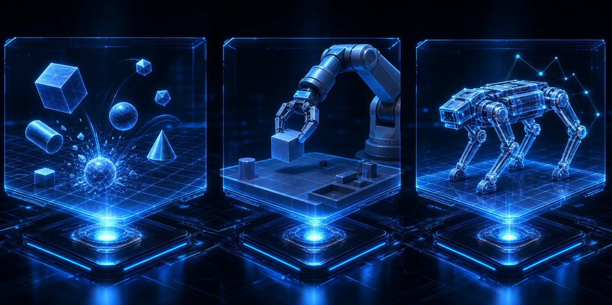

## MuJoCo란

**MuJoCo(Multi-Joint dynamics with Contact)** 는 Google DeepMind가 개발·관리하는 물리 시뮬레이션 엔진입니다. 이름에서 알 수 있듯이 **다관절 동역학(multi-joint dynamics)** 과 **접촉(contact)** 처리에 특화되어 있습니다.

원래 2012년 Emo Todorov 교수팀이 개발하여 상용 라이선스로 배포되었으나, 2021년 DeepMind가 인수한 뒤 2022년 **완전 오픈소스**로 전환했습니다. Apache 2.0 라이선스로 무료 사용이 가능합니다.

### 왜 MuJoCo인가

로봇 학습에서 MuJoCo가 널리 채택된 이유는 **접촉 정확성(contact accuracy)** 입니다.

물체를 집거나 지면을 디디는 동작은 모두 접촉이 핵심입니다. 접촉 처리가 부정확한 시뮬레이터에서는 물체가 관통하거나, 잘못된 마찰력이 계산되거나, 시뮬레이션이 불안정해집니다. MuJoCo는 **부드러운 접촉 모델(soft contact model)** 과 **제약 기반 솔버(constraint-based solver)** 를 사용하여 이 문제를 잘 다룹니다.

```text
┌──────────────────────────────────────────────────────────────────┐
│              MuJoCo 물리 모델 핵심 요소                           │
│                                                                  │
│  관절 공간 (Joint Space)                                         │
│  ├─ 힌지(hinge), 슬라이드(slide), 볼(ball) 조인트               │
│  ├─ 자유도(DoF) 제한 및 댐핑 설정                                │
│  └─ 액추에이터(actuator): 토크, 속도, 위치 제어                 │
│                                                                  │
│  접촉 모델 (Contact Model)                                       │
│  ├─ 부드러운 접촉: 침투 허용 후 복원력 적용                     │
│  ├─ 마찰 원뿔(friction cone): 정적/동적 마찰                    │
│  └─ 처리 속도와 정확도의 균형                                    │
│                                                                  │
│  시뮬레이션 루프                                                 │
│  └─ 전진 동역학(forward dynamics) → 상태 업데이트               │
└──────────────────────────────────────────────────────────────────┘
```

## MuJoCo 기본 사용법

MuJoCo는 Python 바인딩을 통해 사용합니다.

```python
# 개념 이해용 의사코드 — mujoco Python 패키지 기반
import mujoco
import numpy as np

# MJCF(XML) 모델 로드
model = mujoco.MjModel.from_xml_path("robot.xml")
data = mujoco.MjData(model)

# 시뮬레이션 스텝
mujoco.mj_resetData(model, data)

for step in range(1000):
    # 액추에이터 제어 신호 설정
    data.ctrl[:] = compute_control(data.qpos, data.qvel)

    # 한 스텝 전진
    mujoco.mj_step(model, data)

    # 상태 읽기
    joint_positions = data.qpos.copy()   # 관절 위치
    joint_velocities = data.qvel.copy()  # 관절 속도
    sensor_data = data.sensordata.copy() # 센서 출력
```

MuJoCo 모델은 **MJCF(MuJoCo XML Format)** 로 정의됩니다. 링크, 관절, 센서, 액추에이터, 카메라를 XML로 기술하며, Unified Robot Description Format(URDF)에서 변환하는 도구도 제공됩니다.

## MJX: JAX로 가속하는 MuJoCo

**MJX(MuJoCo XLA)** 는 MuJoCo의 핵심 물리 연산을 **JAX** 위에 구현한 버전입니다. JAX는 GPU/TPU에서 배열 연산을 자동 병렬화하는 Python 라이브러리입니다.

MJX의 핵심 이점은 **vmap(벡터화 맵)** 을 통한 환경 병렬화입니다.

```python
# 개념 이해용 의사코드 — MJX API
import jax
import jax.numpy as jnp
import mujoco.mjx as mjx

model = mjx.put_model(mujoco_model)  # GPU 메모리로 이전

# 수천 개 환경을 동시에 스텝
@jax.vmap
def batch_step(data, ctrl):
    data = data.replace(ctrl=ctrl)
    return mjx.step(model, data)

# 4096개 환경 동시 실행
batch_data = jax.vmap(mjx.make_data)(model)
batch_ctrl = jnp.zeros((4096, model.nu))
batch_data = batch_step(batch_data, batch_ctrl)
```

CPU에서 순차적으로 실행하던 환경을 GPU에서 수천 개 병렬 실행하면, 강화학습에서 경험 수집 속도가 수십 배 빨라집니다.

## MuJoCo Playground

**MuJoCo Playground**는 Google DeepMind가 MJX 위에 구축한 로봇 학습 환경 모음입니다. MJX의 GPU 병렬 실행 능력을 활용하면서, 연구자들이 바로 사용할 수 있는 표준 환경과 학습 루프를 제공합니다.

```text
┌──────────────────────────────────────────────────────────────────┐
│              MuJoCo Playground 환경 범주                         │
│                                                                  │
│  이동(Locomotion)                                                │
│  ├─ 사족 보행 (Quadruped: ANYmal, Spot 유사)                    │
│  ├─ 이족 보행 (Biped)                                            │
│  └─ Hopper, Cheetah 등 고전 벤치마크                           │
│                                                                  │
│  조작(Manipulation)                                              │
│  ├─ 로봇 팔 집기·놓기                                           │
│  ├─ 손가락 조작 (Dexterous Hand)                               │
│  └─ 도구 사용                                                    │
│                                                                  │
│  특수 과제                                                       │
│  ├─ 카트폴(CartPole) 등 제어 벤치마크                           │
│  └─ 사용자 정의 환경 추가 가능                                   │
└──────────────────────────────────────────────────────────────────┘
```

Playground의 핵심 특징:
- **빠른 시작**: 몇 줄 코드로 학습 루프 실행
- **GPU 병렬화**: MJX 덕분에 단일 GPU에서 수천 환경 동시 실행
- **표준 인터페이스**: Gymnasium/Brax 호환 API

## MuJoCo의 한계

MuJoCo가 모든 용도에 최적은 아닙니다.

**시각적 사실감 부족**: 기본 렌더러는 연구용 수준이며, 실제 카메라 영상과 시각적으로 크게 다릅니다. 도메인 무작위화나 별도 렌더링 엔진이 필요할 수 있습니다.

**유연체·유체 미지원**: 천, 종이, 물 같은 변형 가능한 물체나 유체 시뮬레이션은 기본 지원되지 않습니다.

**대규모 씬 복잡도**: 수백 개 물체가 상호작용하는 복잡한 씬에서는 성능이 저하됩니다.

다음 챕터에서는 2024년 공개된 새로운 범용 물리 시뮬레이터 Genesis를 살펴봅니다.
