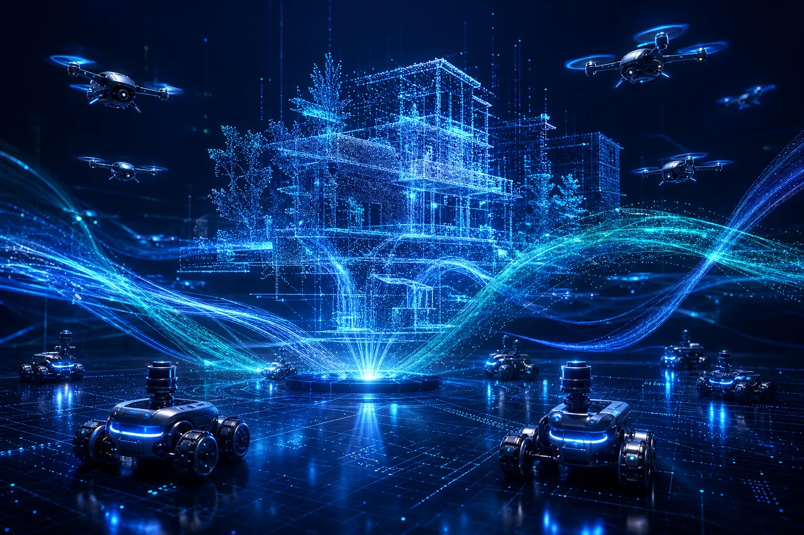

## 왜 물리 AI에서 안전이 특별한가

언어 모델이 잘못된 답변을 생성하면 사용자가 수정을 요청할 수 있습니다. 하지만 물리 AI 시스템이 잘못된 행동을 수행하면 공장 작업자가 부상을 입거나, 로봇 팔이 파손되거나, 주변 기기가 손상됩니다. **행동의 물리적 비가역성(physical irreversibility)** 이 안전을 최우선 요건으로 만드는 핵심 이유입니다.

물리 AI 시스템의 안전 요건은 크게 세 층위로 구분됩니다.

1. **기계적 안전(mechanical safety)**: 로봇의 물리적 충돌, 과부하, 과열을 방지하는 하드웨어 수준의 보호.
2. **동작 안전(motion safety)**: 실행 중인 궤적이 사람이나 장애물과 충돌하지 않도록 보장하는 소프트웨어·알고리즘 수준.
3. **시스템 안전(system safety)**: 센서 고장, 통신 끊김, 예외 상황에서 시스템 전체가 안전한 상태로 전환되는 아키텍처 수준.

```text
┌──────────────────────────────────────────────────────────────────────┐
│                  물리 AI 안전의 세 층위                               │
├────────────────────┬─────────────────────┬───────────────────────────┤
│ 기계적 안전        │ 동작 안전           │ 시스템 안전               │
├────────────────────┼─────────────────────┼───────────────────────────┤
│ 토크 제한 회로     │ 충돌 감지/회피      │ Fail-safe 상태 천이       │
│ 과열 보호          │ 속도 제한           │ 워치독(watchdog) 타이머   │
│ 비상 정지(E-Stop)  │ 작업 공간 제한      │ 이중화(redundancy) 설계   │
│ 힘/토크 센서       │ 실시간 경로 재계획  │ 안전 모니터 분리          │
└────────────────────┴─────────────────────┴───────────────────────────┘
```

## 안전 강화학습(Safe Reinforcement Learning)

표준 강화학습(RL)은 누적 보상(cumulative reward)을 최대화하는 것만 목표로 합니다. 이 과정에서 에이전트는 보상이 높다면 위험한 행동도 선택할 수 있습니다. **안전 RL(Safe RL)** 은 보상 최대화와 동시에 안전 제약(safety constraint)을 만족시키는 것을 목표로 합니다.

### 제약 마르코프 결정 과정(CMDP)

안전 RL의 표준 수학적 틀은 **CMDP(Constrained Markov Decision Process)** 입니다. 기본 MDP에 비용 함수(cost function) $C(s, a)$와 임계값(threshold) $d$를 추가합니다.

목표는 다음을 동시에 달성하는 것입니다.
- 누적 보상 $J_R(\pi)$ 최대화
- 누적 비용 $J_C(\pi) \leq d$ 만족

이 공식화를 기반으로 한 주요 알고리즘들이 있습니다.

**CPO(Constrained Policy Optimization)**: 신뢰 영역(trust region) 기법을 확장하여 정책 업데이트 시 비용 제약을 명시적으로 강제합니다. 한 번의 업데이트로 보상을 늘리면서 비용 예산을 넘지 않는 방향을 탐색합니다.

**라그랑지안(Lagrangian) 방법**: 비용 제약을 페널티 항으로 변환하여 제약 최적화를 비제약 문제로 환원합니다. 라그랑지안 승수(Lagrange multiplier)를 적응적으로 조정하여 비용 예산 준수를 유도합니다.

### 리워드 쉐이핑과 안전 레이어

제약 최적화 외에도 두 가지 접근이 널리 사용됩니다.

**리워드 쉐이핑(reward shaping)**: 위험한 상태에 도달할 때 음수 보상(negative reward)을 부여하여 에이전트가 간접적으로 안전한 행동을 학습하도록 합니다. 구현이 단순하지만, 리워드 설계가 안전과 성능 사이의 균형에 크게 영향을 미칩니다.

**안전 레이어(safety layer) / 실드(shield)**: 학습된 정책이 출력한 행동을 실행 전에 안전 필터가 검사하고, 제약을 위반하는 행동을 안전한 행동으로 투영(projection)합니다. 정책 학습과 안전 보장을 분리하므로 이론적으로 더 강력합니다.

```text
┌───────────────────────────────────────────────────────────────────┐
│                 안전 레이어(Safety Layer) 구조                     │
│                                                                   │
│  관측(s) ──▶ RL 정책(π) ──▶ 원래 행동(a) ──▶ 안전 필터 ──▶ 실행  │
│                                                  │                │
│                                          제약 위반 시:            │
│                                          a* = argmin ||a-a'||     │
│                                          s.t. a' 안전 영역 내     │
└───────────────────────────────────────────────────────────────────┘
```

## 형식 검증(Formal Verification)

**형식 검증**은 수학적 증명을 통해 시스템이 명세(specification)를 반드시 만족함을 보장합니다. 안전 임계(safety-critical) 도메인(항공, 의료기기, 원자력)에서 오랫동안 사용되어 왔으며, 물리 AI에도 적용이 시도되고 있습니다.

**시간 논리(temporal logic)**: LTL(Linear Temporal Logic), STL(Signal Temporal Logic) 등을 사용하여 "항상 힘은 50N 미만이어야 한다", "10초 이내에 목표에 도달해야 한다" 같은 시간적 성질을 형식적으로 표현합니다.

**장벽 함수(barrier function / CBF)**: 제어 배리어 함수(Control Barrier Function, CBF)는 시스템 상태가 안전 집합(safe set) 안에 머무르도록 제어 입력을 실시간으로 수정합니다. 학습 기반 정책과 결합하면 이론적 안전 보장과 유연한 행동을 동시에 얻을 수 있습니다.

형식 검증의 현실적 한계도 있습니다. 신경망 기반 정책은 복잡도가 높아 완전한 형식적 증명이 어렵고, 연속 상태/행동 공간에서 계산 비용이 매우 큽니다. 현재는 특정 부분 시스템(충돌 회피, 속도 제한)에 한정 적용하는 것이 현실적입니다.

## 불확실성 추정(Uncertainty Estimation)

물리 AI 시스템은 새로운 환경이나 예상치 못한 물체를 만날 수 있습니다. 이때 모델이 자신의 **불확실성을 인식**하고 행동을 조정하는 능력이 안전성에 중요합니다.

**인식론적 불확실성(epistemic uncertainty)**: 모델이 학습하지 못한 영역(out-of-distribution)에서 발생하는 불확실성. 더 많은 데이터로 줄일 수 있습니다.

**우연적 불확실성(aleatoric uncertainty)**: 센서 노이즈처럼 데이터 자체에 내재된 불확실성. 데이터를 늘려도 줄어들지 않습니다.

주요 추정 방법으로는 **MC 드롭아웃(MC Dropout)**, **딥 앙상블(Deep Ensemble)**, **베이지안 신경망(Bayesian Neural Network)**, **컨포멀 예측(Conformal Prediction)** 등이 있습니다. 불확실성이 임계값을 넘으면 속도를 낮추거나 인간에게 제어권을 넘기는 방식으로 활용됩니다.

## Fail-Safe 설계

**Fail-safe**는 시스템이 고장났을 때 안전한 상태로 자동 전환되는 설계 원칙입니다.

- **통전 실패 정지(fail-stop)**: 전원 공급이 끊기면 로봇이 즉시 멈추거나 안전한 자세를 취합니다. 브레이크가 기본적으로 잠기는(normally-closed) 설계가 일반적입니다.
- **통신 단절 처리**: 제어 컴퓨터와의 연결이 끊기면 로봇이 현재 위치를 유지하거나 미리 정의된 안전 위치로 이동합니다.
- **워치독 타이머(watchdog timer)**: 제어 루프가 예상 주기 내에 응답하지 않으면 안전 모드로 전환합니다.
- **토크/힘 제한(torque/force limiting)**: 관절에 과부하가 감지되면 해당 관절의 구동을 즉시 중단합니다.

## 인간-로봇 협업 안전(Human-Robot Collaboration Safety)

**협동 로봇(collaborative robot, cobot)** 은 안전 펜스 없이 인간과 같은 공간에서 작동합니다. 이 환경에서의 안전 기준은 산업 표준으로 정의되어 있습니다.

**ISO 10218**: 산업용 로봇의 안전 요건을 정의하는 국제 표준으로, 로봇 설계자와 통합자 양측의 의무를 규정합니다.

**ISO/TS 15066**: 협동 로봇 운용에 특화된 기술 규격. 인간과 로봇이 함께 작업할 때 허용 가능한 힘·압력 임계값, 속도 제한 등을 구체적으로 명시합니다.

네 가지 협동 모드가 정의되어 있습니다.

```text
┌───────────────────────────────────────────────────────────────────┐
│               ISO/TS 15066 협동 운용 모드                          │
├──────────────────────┬────────────────────────────────────────────┤
│ 모드                 │ 설명                                       │
├──────────────────────┼────────────────────────────────────────────┤
│ 안전 등급 모니터링   │ 사람 감지 시 로봇이 안전 상태로 전환       │
│ 손 안내(HG)          │ 사람이 직접 로봇을 가이드하며 작업         │
│ 속도·거리 모니터링   │ 사람과의 거리에 따라 속도를 동적으로 조정  │
│ 힘·동력 제한(PFL)    │ 접촉 시 힘·압력을 허용 범위 내로 제한      │
└──────────────────────┴────────────────────────────────────────────┘
```

## 실제 적용 시 고려 사항

안전 시스템 설계에서 자주 나타나는 트레이드오프를 인식하는 것이 중요합니다.

**안전 vs. 성능**: 과도한 제약은 로봇이 너무 소심하게 행동하여 실용성이 떨어집니다. 안전 제약의 임계값은 실사용 환경에서 반복 검증이 필요합니다.

**형식적 보장 vs. 학습 유연성**: 형식 검증은 보장이 강하지만 적용 범위가 좁습니다. 학습 기반 접근은 유연하지만 보장이 어렵습니다. 두 방법의 계층적 결합이 현실적인 해법으로 연구되고 있습니다.

**시뮬레이션 안전 vs. 실물 안전**: 시뮬레이터에서 안전하게 검증된 정책도 sim-to-real 갭으로 인해 실물에서 예상치 못한 행동을 할 수 있습니다. 실물 테스트는 항상 통제된 환경에서 단계적으로 진행해야 합니다.

물리 AI의 안전성은 단일 알고리즘으로 해결되는 문제가 아닙니다. 하드웨어 설계, 제어 알고리즘, 시스템 아키텍처, 운용 절차, 그리고 국제 표준 준수가 모두 결합되어야 신뢰할 수 있는 시스템이 만들어집니다.
